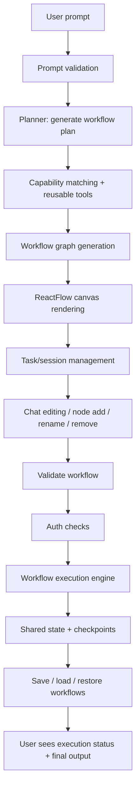
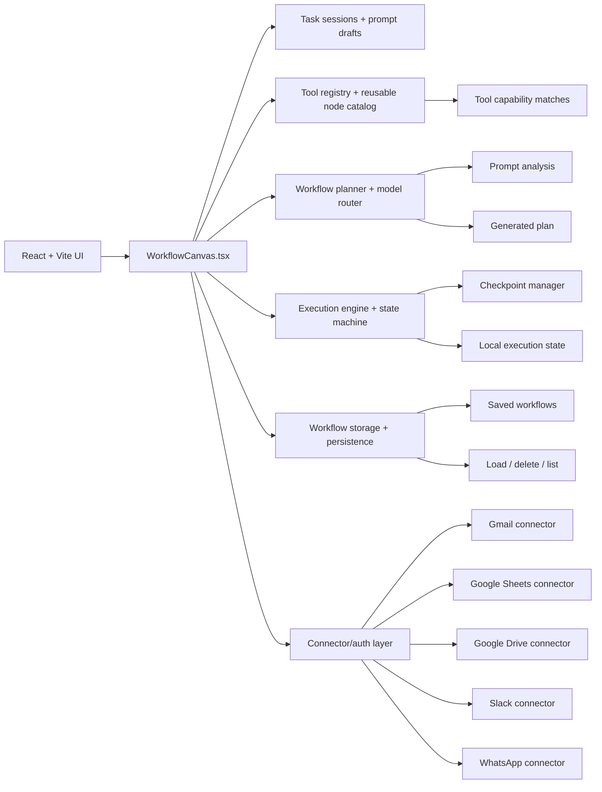
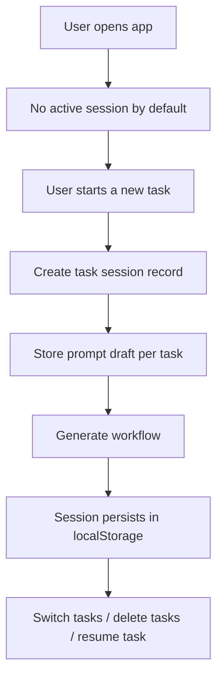
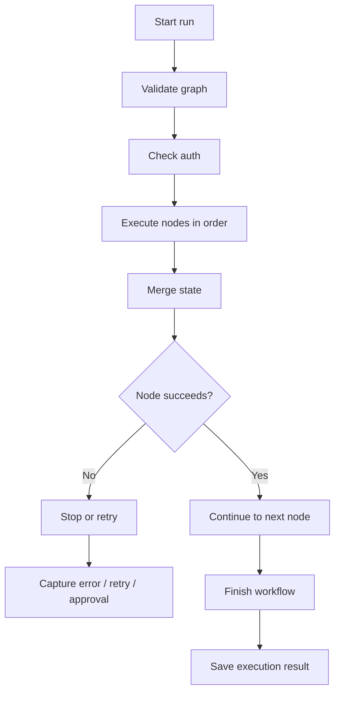

# AutoAgent Project Flow

This document explains how the product works today and how the main flow is designed as a prompt-to-workflow system.

## 1. Product idea

AutoAgent is a workflow builder that turns a natural-language prompt into a visual automation graph, then runs it with tool nodes, validation, auth checks, and state wiring.

The system is intentionally more deterministic than a free-form autonomous agent:
- generate a workflow plan from a user prompt
- map it to reusable tool/action nodes
- render the workflow on a canvas
- validate missing auth and required capabilities
- execute node-by-node with shared state
- allow chat-driven editing and re-planning

---

## 2. High-level flow

---

## 3. Core data flow

### Step 1: prompt enters
The user types a prompt in the main entry screen.

Examples:
- "Create a lead qualification workflow"
- "Send a Gmail summary and store it in a sheet"
- "Add approval before sending Slack alerts"

The app validates whether the prompt is meaningful enough to build a workflow.

### Step 2: plan generation
The planner analyzes the prompt and creates a structured workflow plan.

Main logic:
- `generateWorkflowPlan(...)`
- `validateGeneratedPlan(...)`
- `planToWorkflow(...)`

This produces:
- nodes
- edges
- required tools
- capability hints
- state contracts

### Step 3: tool matching
The app matches the natural-language goal to tool capabilities using the tool registry.

Examples:
- Gmail send action
- Google Sheets append row
- Slack post message
- WhatsApp send message
- Google Drive file actions

This is where reusable nodes become useful.

### Step 4: canvas rendering
The graph is rendered with ReactFlow.

The canvas includes:
- trigger nodes
- tool nodes
- helper nodes
- logic nodes
- output nodes
- edge connections

The UI also supports:
- selecting nodes
- connecting nodes
- inserting reusable helpers
- removing nodes
- editing with chat prompts

### Step 5: execution validation
Before execution, the app validates:
- graph is not empty
- trigger exists
- tool definitions exist
- required auth is present
- workflow is not disconnected

This prevents broken or invalid execution.

### Step 6: authentication and execution
If a required connector is unauthenticated, the app triggers auth and reruns the flow.

Execution uses a shared workflow state object and supports:
- node-by-node streaming
- execution checkpoints
- pause/resume patterns
- approval gating
- failure reporting

---

## 4. Current architecture map

---

## 5. Modules implemented across the project

This project is not a single file. It is a collection of cooperating modules.

### 5.1 UI and workflow builder
- `src/features/workflow/components/WorkflowCanvas.tsx`
  - main canvas and prompt-first workflow experience
  - task/session control and chat editing
  - reusable node insertion and connection logic
  - blank workflow/start state
  - save, load, and execution actions

- `src/features/workflow/components/WorkflowNode.tsx`
  - renders node visuals for trigger, tool, logic, output, and helper nodes

- `src/features/workflow/components/ExecutionMonitor.tsx`
  - shows execution state, logs, and output progress

### 5.2 AI planning and model routing
- `src/features/ai/config.ts`
  - model selection and routing recommendations

- `src/features/ai/services/workflowPlanGenerator.ts`
  - converts prompt into a structured workflow plan

- `src/features/ai/services/aiService.ts`
  - general AI execution abstraction layer

### 5.3 Tools and connector orchestration
- `src/features/tools/toolRegistry.ts`
  - defines tools, actions, capability matching, and reusable templates

- `src/features/tools/useTools.ts`
  - authenticated tool status and runtime access

- `src/features/tools/connectors/index.ts`
  - central connector export surface

- `src/features/tools/connectors/gmail.ts`
- `src/features/tools/connectors/googleSheets.ts`
- `src/features/tools/connectors/googleDrive.ts`
- `src/features/tools/connectors/slack.ts`
- `src/features/tools/connectors/whatsapp.ts`
  - tool-specific connector logic and auth flows

### 5.4 Workflow execution and persistence
- `src/features/workflow/hooks/useWorkflowExecution.ts`
  - the ONLY execution engine: the flow execution loop, state merging,
    conditional routing, approval gates, and checkpointing
  - a second LangGraph-based engine (`langgraphExecutor.ts`,
    `checkpointManager.ts`, `useWorkflowExecutionLangGraph.ts`) was deleted; the
    two had diverged and only this one was ever reachable from the UI

- `src/features/workflow/services/safeExpression.ts`
  - restricted evaluator for edge routing conditions

- `src/features/workflow/services/workflowStorage.ts`
  - save, list, delete, and reload workflow graphs

### 5.5 Task orchestration and UX state
- session/task state inside `WorkflowCanvas.tsx`
  - prompt drafts per task
  - active task switching
  - task naming from the user prompt
  - URL session tracking
  - localStorage persistence

---

## 6. Main code areas

### Frontend UI
- `src/features/workflow/components/WorkflowCanvas.tsx`
  - main workflow builder
  - prompt composer
  - task management
  - chat editor
  - canvas actions

### Workflow engine
- `src/features/workflow/hooks/useWorkflowExecution.ts`
  - execution logic and state management

### AI logic
- `src/features/ai/services/workflowPlanGenerator.ts`
  - prompt -> workflow plan
- `src/features/ai/config.ts`
  - model selection and routing

### Tool registry
- `src/features/tools/toolRegistry.ts`
  - tool definitions
  - action matching
  - capability ranking

### Connectors
- `src/features/tools/connectors/`
  - Gmail
  - Google Sheets
  - Google Drive
  - Slack
  - WhatsApp

### Storage
- `src/features/workflow/services/workflowStorage.ts`
  - save/load workflows
  - delete/list stored flows

---

## 6. Task/session flow

The app also supports ChatGPT-style task sessions:

Important behavior:
- each task keeps its own draft
- task names come from the prompt content when valid
- invalid prompts are rejected before workflow generation
- task IDs are only used when there is a real started task

---

## 7. Execution loop

---

## 8. Important product rules currently enforced

- workflow generation should be prompt-driven but bounded
- tool usage should be reusable and predictable
- auth must be checked before execution
- invalid prompts should not generate a workflow plan
- same task state must not leak into another task
- node ids and edge ids must be unique

---

## 9. What is being implemented now

The project is currently evolving around these patterns:
1. better chat-first task UX
2. cleaner prompt-to-workflow onboarding
3. true per-task draft/state isolation
4. connection and node duplication safety
5. deterministic execution with visible logs
6. save/load and task persistence

---

## 10. Recommended mental model

Think of the app as:

Prompt -> Planner -> Reusable tool graph -> Visual workflow canvas -> Safe execution engine

It is not a fully free-form autonomous loop. It is a structured workflow orchestration system with AI assistance at the planning and editing layer, while execution remains explainable and controlled.
